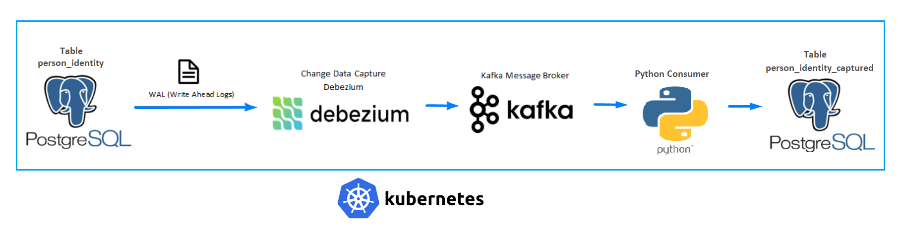
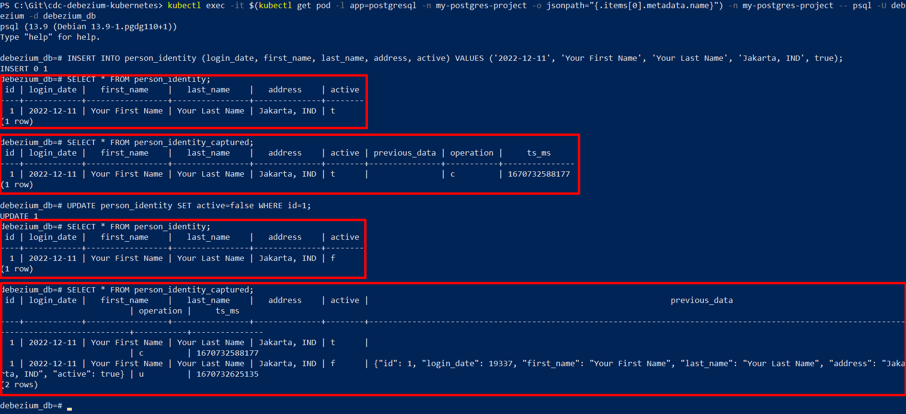
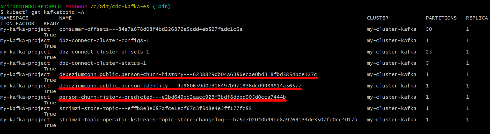
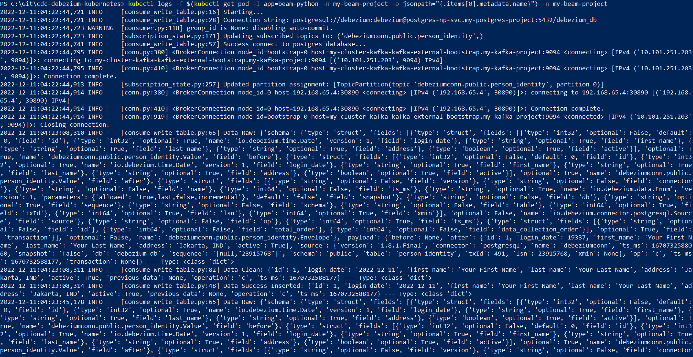
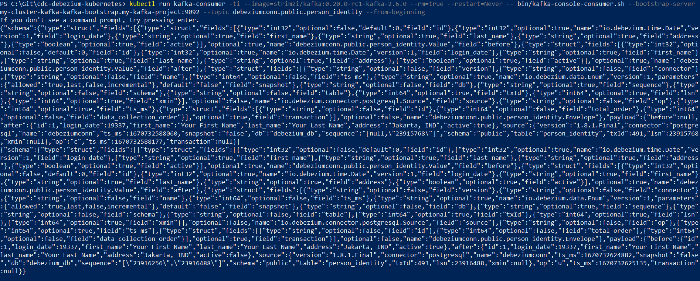

<!--
This repository shows you the implementation of CDC process by using Debezium and Kafka. The data will be transformed by Spark and will write to Elasticsearch to visualize using Kibana. 
-->

# Stream prediction using Spark ML, Debezium and Kafka on Kubernetes

`Important Note: This project is for Testing or Development purpose, not suggested for Production`


## Architecture Components



## Prerequisites
- *Docker*
- *Kubernetes*
- *Minikube*


## Setup
I have configured 2 tables in the postgres yaml deployment file. The 2 tables are `person_identity` and `person_identity_captured`. The main purpose of this project will show you that every change in the `person_identity` table will also be captured in the `person_identity_captured` table using debezium on kubernetes.

### 1. Clone Project
You can clone this project using command:

    $ git clone https://github.com/arinannp/cdc-debezium-kubernetes.git

### 2. Create Kubernetes Namespaces
You can apply your kubernetes resources in different namespaces, so you can easily isolate, debug and manage them on your kubernetes.

If you are new to kubernetes you can find a well-explained documentation on the kubernetes website: https://kubernetes.io/.

In this project, we are going to create 3 different namespaces, using command:

    $ kubectl create ns my-kafka-project
    $ kubectl create ns my-postgres-project
    $ kubectl create ns my-beam-project

Note:
- `my-kafka-project` namespace -> used to hold the kafka resources
- `my-postgres-project` namespace -> used to hold the postgres db
- `my-beam-project` namespace -> used to hold the python app that will consume the kafka messages

### 3. Install Strimzi as A Kubernetes Operator
Strimzi Operators can simplify many Kafka related processes including: deploying, running and managing Kafka cluster and components, configuring and securing access to Kafka, creating and managing topics and users, etc.

You can easily deploy many components of kafka with help of strimzi operator, for example:
- Kafka: A cluster of Kafka broker nodes
- ZooKeeper: Storing configuration data and cluster coordination
- Kafka Connect: An integration toolkit for streaming data between Kafka brokers and external systems using Connector (source and sink) plugins. (Also supports Source2Image)
- Kafka MirrorMaker: Replicating data between two Kafka clusters, within or across data centers.
- Kafka Bridge: Providing a RESTful interface for integrating HTTP-based clients with a Kafka cluster without the need for client applications to understand the Kafka protocol
- Kafka Exporter. Extracting data for analysis as Prometheus metrics like offsets, consumer groups, consumer lag, topics and etc

For more information about strimzi and kubernetes operator, you can find in these links:
- https://strimzi.io/
- https://kubernetes.io/docs/concepts/extend-kubernetes/operator/

To install strimzi operator, run this command:
    
    $ kubectl create -f strimzi-0.31.1/cluster-operator/ -n my-kafka-project

### 4. Deploy your Kafka Cluster
After the strimzi operator already installed, then you can deploy your kafka cluster using this command:

    $ kubectl apply -f kubernetes/kafka-myproject-kafkacluster.yaml

Wait for kafka cluster deployed with status ready:

    $ kubectl wait kafka/my-cluster-kafka --for=condition=Ready --timeout=600s -n my-kafka-project

### 5. (Optional) Test your Kafka Cluster
- Create a topic that will hold your message:

        $ kubectl apply -f kubernetes/kafka-myproject-kafkatopic.yaml

Note: name of the topic is `my-topic-testing`, you can change it with your own preferences by editing the yaml file.

- Wait for the deployment to be completed:

        $ kubectl wait kafkatopic/my-topic-testing --for=condition=Ready --timeout=300s -n my-kafka-project

- Start to push your message to the topic by running command:

        $ kubectl run kafka-producer -ti --image=strimzi/kafka:0.20.0-rc1-kafka-2.6.0 --rm=true --restart=Never -- bin/kafka-console-producer.sh --broker-list my-cluster-kafka-kafka-bootstrap.my-kafka-project:9092 --topic my-topic-testing

- Open the second console/terminal and run this command to consume and verify the message:

        $ kubectl run kafka-consumer -ti --image=strimzi/kafka:0.20.0-rc1-kafka-2.6.0 --rm=true --restart=Never -- bin/kafka-console-consumer.sh --bootstrap-server my-cluster-kafka-kafka-bootstrap.my-kafka-project:9092 --topic my-topic-testing --from-beginning

You can see that any messages you wrote in the producer terminal will be shown in the consumer terminal. That means your kafka works well. Well done!

### 6. Deploy Kafka Connect
Kafka Connect is a framework used for connecting Kafka with external systems and stream data into and out of the Kafka cluster reliably with the help of connector plugins. So, in this project we will use Kafka Connect to connect with the Debezium and Postgres DB.

Create your kafka connect by using command:

    $ kubectl apply -f kubernetes/kafka-myproject-kafkaconnect.yaml -n my-kafka-project

Wait the kafka connect deployment until finished:

    $ kubectl wait kafkaconnect/my-cluster-kafkaconnect-dbz --for=condition=Ready --timeout=300s -n my-kafka-project

### 7. Deploy PostgreSQL Database
Create postgres database and table as the data source that every change will be captured:

    $ kubectl apply -f kubernetes/kafka-myproject-postgres.yaml -n my-postgres-project

Wait for completion:

    $ kubectl wait deployment/my-postgresdb --for=condition=Available=True --timeout=300s -n my-postgres-project

You can see the initial tables were configured in this link: [init-tables.sql](https://github.com/arinannp/cdc-debezium-kubernetes/blob/main/docker/postgresql/initdb.sql)

### 8. Deploy & Configure Debezium and Kafka Connector
Configure the debezium that will get the log from postgres and configure the output format will be sent to kafka using kafka connector:

    $ kubectl apply -f kubernetes/kafka-myproject-debezium.yaml -n my-kafka-project

Wait for completion:

    $ kubectl wait kafkaconnector/my-connector-dbz --for=condition=Ready --timeout=300s -n my-kafka-project

### 9. Deploy The Python Consumer Application
I have created a python docker image that will consume messages from kafka topic which the topic's messages contain captured change data from table `person_identity`. Those messages will be written to table `person_identity_captured`:

    $ kubectl apply -f kubernetes/kafka-myproject-pythonkafka.yaml -n my-beam-project

Wait for the deployment to be completed:

    $ kubectl wait deployment/my-consumerbeam --for=condition=Available=True --timeout=300s -n my-beam-project

### 10. Test Capturing Data Changes From Postgres Table
- Try to get in to the postgres pod and connect with an interactive terminal to work with postgres database:

        $ kubectl exec -it $(kubectl get pod -l app=postgresql -n my-postgres-project -o jsonpath="{.items[0].metadata.name}") -n my-postgres-project -- psql -U debezium -d debezium_db

- You can run an insert-query to add a row in the `person_identity` table:
    
        $ INSERT INTO person_identity (login_date, first_name, last_name, address, active) VALUES ('2022-12-11', 'Your First Name', 'Your Last Name', 'Jakarta, IND', true);

- Update the row of table `person_identity` where the id is 1:

        $ UPDATE person_identity SET active=false WHERE id=1;

- Verify that any change is already inserted in the `person_identity` table:

        $ SELECT * FROM person_identity;

- Check the `person_identity_captured` table, is the change data already captured:

        $ SELECT * FROM person_identity_captured;

- List all topics reside in kafka cluster. You will see `debeziumconn.public.person_identity` topic that is used to hold the CDC messages

        $ kubectl run kafka-topiclist -it --image=strimzi/kafka:0.20.0-rc1-kafka-2.6.0 --rm=true --restart=Never -- bin/kafka-topics.sh --bootstrap-server my-cluster-kafka-kafka-bootstrap.my-kafka-project:9092 --list

- Open second terminal and try to debug the topic's messages in the python-app pod logs: 

        $ kubectl logs -f $(kubectl get pod -l app=beam-python -n my-beam-project -o jsonpath="{.items[0].metadata.name}") -n my-beam-project

OR, stream the topic's messages in your terminal:

        $ kubectl run kafka-consumer -ti --image=strimzi/kafka:0.20.0-rc1-kafka-2.6.0 --rm=true --restart=Never -- bin/kafka-console-consumer.sh --bootstrap-server my-cluster-kafka-kafka-bootstrap.my-kafka-project:9092 --topic debeziumconn.public.person_identity --from-beginning

###### .
PostgreSQL Operation:


###### .
Kafka Topics:


###### .
Python App Logs:


###### .
Stream Messages Output from CDC Topic:



###### Output Insert Query:
```
{
    "schema": {
        ...
    },
    "payload": {
        "before": null,
        "after": {
            "id": 1,
            "login_date": 19337,
            "first_name": "Your First Name",
            "last_name": "Your Last Name",
            "address": "Jakarta, IND",
            "active": true
        },
        "source": {
            "version": "1.8.1.Final",
            "connector": "postgresql",
            "name": "debeziumconn",
            "ts_ms": 1670732588060,
            "snapshot": "false",
            "db": "debezium_db",
            "sequence": "[null,\"23915768\"]",
            "schema": "public",
            "table": "person_identity",
            "txId": 491,
            "lsn": 23915768,
            "xmin": null
        },
        "op": "c",
        "ts_ms": 1670732588177,
        "transaction": null
    }
}

```

###### Output Update Query:
```
{
    "schema": {
        ...
    },
    "payload": {
        "before": {
            "id": 1,
            "login_date": 19337,
            "first_name": "Your First Name",
            "last_name": "Your Last Name",
            "address": "Jakarta, IND",
            "active": true
        },
        "after": {
            "id": 1,
            "login_date": 19337,
            "first_name": "Your First Name",
            "last_name": "Your Last Name",
            "address": "Jakarta, IND",
            "active": false
        },
        "source": {
            "version": "1.8.1.Final",
            "connector": "postgresql",
            "name": "debeziumconn",
            "ts_ms": 1670732624882,
            "snapshot": "false",
            "db": "debezium_db",
            "sequence": "[\"23916256\",\"23916488\"]",
            "schema": "public",
            "table": "person_identity",
            "txId": 493,
            "lsn": 23916488,
            "xmin": null
        },
        "op": "u",
        "ts_ms": 1670732625135,
        "transaction": null
    }
}
```


## Cleanup Your Resources
Delete and Remove any resources that you have build for this project:

    $ kubectl delete ns my-kafka-project
    $ kubectl delete ns my-postgres-project
    $ kubectl delete ns my-beam-project
    $ kubectl delete -f strimzi-0.31.1/cluster-operator/


## References
- https://strimzi.io/downloads/
- https://debezium.io/releases/1.7/
- https://debezium.io/documentation/reference/1.7/connectors/postgresql.html#postgresql-connector-properties
- https://kafka.apache.org/documentation/#brokerconfigs