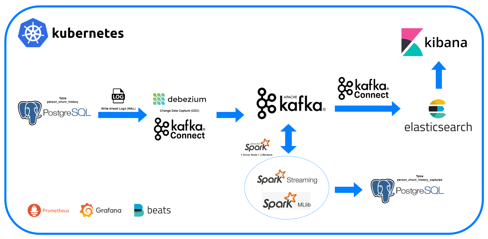
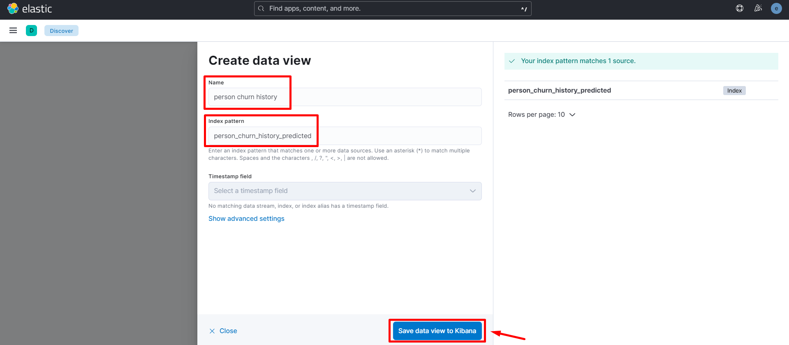

<!--
This repository shows you the implementation of CDC process by using Debezium and Kafka. The data will be transformed by Spark and will write to Elasticsearch to visualize using Kibana. 
-->

# Stream prediction using Spark ML, Debezium and Kafka on Kubernetes
`Important Note: This project is for Testing or Development purpose, not suggested for Production`


## Architecture Components



## Prerequisites
- *Minimum 20GB free spaces Storage, 16GB of RAM and Core i5 Gen 10th of CPU*
- *Docker Dekstop*
- *Kubernetes*


## Overview
I have configured 2 tables in the postgres docker image. These 2 tables are: 

- `person_churn_history`, and 
- `person_churn_history_captured`

The main purpose of this project will show you that every changes in the `person_churn_history` table will also be captured in the `person_churn_history_captured` table using Kafka, Debezium and Spark as data processing. The result will also be sent to Elasticsearch and visualize using Kibana. All of these tools will be built on Kubernetes.


## Setup
### 1. Clone Project
You can clone this project using command (After that, move the working directory to this repository):

    $ git clone https://github.com/arinannp/cdc-kafka-es.git


### 2. Create Kubernetes Namespaces
You can apply your kubernetes resources in different namespaces, so you can easily isolate, debug and manage them on your kubernetes.

If you are new to kubernetes you can find a well-explained documentation on the kubernetes website: https://kubernetes.io/.

In this project, we are going to create 3 different namespaces, using commands:

    $ kubectl create ns my-kafka-project
    $ kubectl create ns my-postgres-project
    $ kubectl create ns my-spark-project

Note:
- `my-kafka-project` namespace -> used to hold the kafka resources
- `my-postgres-project` namespace -> used to hold the postgres db
- `my-spark-project` namespace -> used to hold the pyspark applications that will consume the kafka messages


### 3. Install Strimzi as A Kubernetes Operator
Strimzi Operators can simplify many Kafka related processes including: deploying, running and managing Kafka cluster and components, configuring and securing access to Kafka, creating and managing topics and users, etc.

You can easily deploy many components of kafka with help of strimzi operator, for example:
- Kafka: A cluster of Kafka broker nodes
- ZooKeeper: Storing configuration data and cluster coordination
- Kafka Connect: An integration toolkit for streaming data between Kafka brokers and external systems using Connector (source and sink) plugins. (Also supports Source2Image)
- Kafka MirrorMaker: Replicating data between two Kafka clusters, within or across data centers.
- Kafka Bridge: Providing a RESTful interface for integrating HTTP-based clients with a Kafka cluster without the need for client applications to understand the Kafka protocol
- Kafka Exporter: Extracting data for analysis as Prometheus metrics like offsets, consumer groups, consumer lag, topics and etc

For more information about strimzi and kubernetes operator, you can find in these links:
- https://strimzi.io/
- https://kubernetes.io/docs/concepts/extend-kubernetes/operator/

To install strimzi operator, run these commands:
    
    $ kubectl create -f strimzi-0.31.1/cluster-operator/020-RoleBinding-strimzi-cluster-operator.yaml -n my-kafka-project
    $ kubectl create -f strimzi-0.31.1/cluster-operator/031-RoleBinding-strimzi-cluster-operator-entity-operator-delegation.yaml -n my-kafka-project
    $ kubectl create -f strimzi-0.31.1/cluster-operator/ -n my-kafka-project


### 4. Deploy your Kafka Cluster
After the strimzi operator already installed, then you can deploy your kafka cluster by this command:

    $ kubectl apply -f kubernetes/kafka-myproject-kafkacluster.yaml

Wait for kafka cluster to be deployed with status ready:

    $ kubectl wait kafka/my-cluster-kafka --for=condition=Ready --timeout=600s -n my-kafka-project


### 5. Deploy Kafka-Connect to connect with Debezium and Elasticsearch
Kafka Connect is a framework used for connecting Kafka with external systems and stream data into and out of the Kafka cluster reliably with the help of connector plugins. So, in this project we will use Kafka Connect to connect with the Debezium and Elasticsearch.

First, we need to create kubernetes secret as a dummy Elasticsearch connector creds (we will replace this secret later):
    
    $ kubectl create secret generic elasticsearch-cluster-keystore --from-file=elastic-2.5.0/cert/keystore.jks -n my-kafka-project

Create your kafka connect:

    $ kubectl apply -f kubernetes/kafka-myproject-kafkaconnect-elasticsearch.yaml -n my-kafka-project

Wait the kafka connect deployment until finished:

    $ kubectl wait kafkaconnect/my-cluster-kafkaconnect-dbz --for=condition=Ready --timeout=300s -n my-kafka-project


### 6. Deploy PostgreSQL Database
Deploy the postgres database from kubernetes deployment file. This database will work as the data source and data destination that every changes from data source will be captured to data destination:

    $ kubectl apply -f kubernetes/kafka-myproject-postgres.yaml -n my-postgres-project

Wait for completion:

    $ kubectl wait deployment/my-postgresdb --for=condition=Available=True --timeout=300s -n my-postgres-project

You can see SQL create tables statement were configured in this link: [init-tables.sql](https://github.com/arinannp/cdc-kafka-es/blob/main/docker/postgresql/initdb.sql)


### 7. Configure connection between PostgreSQL Database and Debezium
Configure the debezium that will get the logs from postgres and configure the output format that will be sent to kafka using kafka connector:

    $ kubectl apply -f kubernetes/kafka-myproject-debezium.yaml -n my-kafka-project

Wait for completion:

    $ kubectl wait kafkaconnector/my-connector-dbz --for=condition=Ready --timeout=300s -n my-kafka-project


### 8. Login to PostgreSQL Database and start inserting some data
We will try to connect and insert some data to `person_churn_history` table inside PostgreSQL Database. Let's verify that the database works as expected:

    $ kubectl get pod -n my-postgres-project

Open a new terminal/window. Login to debezium_db database as debezium user in PostgreSQL Database:

    $ kubectl exec -it $(kubectl get pod -l app=postgresql -n my-postgres-project -o jsonpath="{.items[0].metadata.name}") -n my-postgres-project -- psql -U debezium -d debezium_db

Start inserting a data to `person_churn_history` table using this sql query:

    $ INSERT INTO person_churn_history 
            (customerID,gender,SeniorCitizen,Partner,Dependents,tenure,PhoneService,MultipleLines,InternetService,OnlineSecurity,OnlineBackup,DeviceProtection,TechSupport,StreamingTV,StreamingMovies,Contract,PaperlessBilling,PaymentMethod,MonthlyCharges,TotalCharges,Churn) 
        VALUES 
            ('2718-YSKCS','Male',0,'Yes','Yes',71,'Yes','No','No','No internet service','No internet service','No internet service','No internet service','No internet service','No internet service','Two year','Yes','Bank transfer (automatic)',20,1387,'No');


### 9. Deploy and Run Spark Applications (Spark MLib & Spark Structured Streaming)
In this step, we are going to deploy and run Spark apps to kubernetes. Before we can start, we have to update the persistent volume path to mount to your local directory inside these files:

- [spark master kubernetes deployment file](https://github.com/arinannp/cdc-kafka-es/blob/main/spark/spark-myproject-master.yaml)
- [spark worker kubernetes deployment file](https://github.com/arinannp/cdc-kafka-es/blob/main/spark/spark-myproject-worker.yaml)

Update the path appropriate to your computer operating system:


Start deploying the Spark deployment files on kubernetes:

- For Spark master or Spark driver:

        $ kubectl apply -f spark/spark-myproject-master.yaml -n my-spark-project
        $ kubectl wait deployment/spark-master-ver324 --for=condition=Available=True --timeout=300s -n my-spark-project

- For Spark workers:

        $ kubectl apply -f spark/spark-myproject-worker.yaml -n my-spark-project
        $ kubectl wait deployment/spark-worker-ver324 --for=condition=Available=True --timeout=300s -n my-spark-project

`Note: you can track the Spark App progress on the Web UI by accessing http://localhost:30030/`


Install Spark application dependencies in all containers (Spark driver and Spark workers):

    $ kubectl exec -it $(kubectl get pod -l app=spark-master-ver324 -n my-spark-project -o jsonpath="{.items[0].metadata.name}") -n my-spark-project -- pip install -r /opt/bitnami/spark/project/requirements.txt
    $ kubectl exec -it $(kubectl get pod -l app=spark-worker-ver324 -n my-spark-project -o jsonpath="{.items[0].metadata.name}") -n my-spark-project -- pip install -r /opt/bitnami/spark/project/requirements.txt
    $ kubectl exec -it $(kubectl get pod -l app=spark-worker-ver324 -n my-spark-project -o jsonpath="{.items[1].metadata.name}") -n my-spark-project -- pip install -r /opt/bitnami/spark/project/requirements.txt

Run Spark application to train a Machine Learning Model that predicts customer churn:

    $ kubectl exec -it $(kubectl get pod -l app=spark-master-ver324 -n my-spark-project -o jsonpath="{.items[0].metadata.name}") -n my-spark-project -- spark-submit --master spark://spark:7077 --conf spark.driver.host=spark-client-master --packages org.apache.spark:spark-sql-kafka-0-10_2.12:3.1.2 --driver-class-path /opt/bitnami/spark/project/connector/postgresql-42.5.1.jar --jars /opt/bitnami/spark/project/connector/postgresql-42.5.1.jar /opt/bitnami/spark/project/random-forest-chun-pred-model.py


Run another Spark application that will consume CDC data from Kafka, get the churn prediction using our previous ML Model and send the data back to another Kafka topic and to the PosgreSQL database:

    $ kubectl exec -it $(kubectl get pod -l app=spark-master-ver324 -n my-spark-project -o jsonpath="{.items[0].metadata.name}") -n my-spark-project -- spark-submit --master spark://spark:7077 --conf spark.driver.host=spark-client-master --packages org.apache.spark:spark-sql-kafka-0-10_2.12:3.1.2 --driver-class-path /opt/bitnami/spark/project/connector/postgresql-42.5.1.jar --jars /opt/bitnami/spark/project/connector/postgresql-42.5.1.jar /opt/bitnami/spark/project/realtime-churn-pred.py


After all Spark applications work as expected, verify that you will have these Kafka topics:


`Note: the hash number on the last line may not be the same as your result`


### 10. Install Elastic-Operator as A Kubernetes Operator

With Elastic Cloud on Kubernetes (ECK) you can extend the basic Kubernetes orchestration capabilities to easily deploy, secure, upgrade your Elasticsearch cluster, and much more. Built on the Kubernetes Operator pattern, Elastic Cloud on Kubernetes (ECK) extends the basic Kubernetes orchestration capabilities to support the setup and management of Elasticsearch, Kibana, APM Server, Enterprise Search, Beats, Elastic Agent, Elastic Maps Server, and Logstash on Kubernetes.

To install elastic operator, run these commands:

    $ kubectl create -f elastic-2.5.0/eck-myproject-crds.yaml -n my-elastic-project
    $ kubectl create -f elastic-2.5.0/eck-myproject-operator.yaml -n my-elastic-project

Check the operator status:

    $ kubectl get all -n my-elastic-project
    $ kubectl logs statefulset.apps/elastic-operator -n my-elastic-project


### 11. Deploy your Elasticsearch Cluster

Let's deploy the elasticsearch database for storing the customer churn data as index:

    $ kubectl apply -f elastic-2.5.0/elasticserach/elastic-myproject-elasticcluster.yaml -n my-elastic-project

Debug the deployment:

    $ kubectl describe elasticsearch elasticsearch-cluster -n my-elastic-project
    $ kubectl get pods --selector='elasticsearch.k8s.elastic.co/cluster-name=elasticsearch-cluster' -n my-elastic-project
    $ kubectl describe pod --selector='elasticsearch.k8s.elastic.co/cluster-name=elasticsearch-cluster' -n my-elastic-project
    $ kubectl logs $(kubectl get pod -l elasticsearch.k8s.elastic.co/version=8.5.3 -n my-elastic-project -o jsonpath="{.items[0].metadata.name}") -n my-elastic-project

Verify that the elasticsearch cluster is in health status:

    $ kubectl get elasticsearch -n my-elastic-project
    $ kubectl get pods -n my-elastic-project
    $ kubectl get svc -n my-elastic-project
    $ kubectl get pvc -n my-elastic-project
    $ kubectl get pv -n my-elastic-project
    $ kubectl get secret -n my-elastic-project


By default in this deployment, elasticsearch will give you an user account for you to connect with the database. The username is `elastic` and you can check the password by this command:

    $ kubectl get secret elasticsearch-cluster-es-elastic-user -n my-elastic-project -o go-template='{{.data.elastic | base64decode}}'


`Note: save this password in a file for future use`

Try to connect to the elasticsearch cluster:

- Login to the elasticsearch pod with bash command:

        $ kubectl exec -it $(kubectl get pod -l elasticsearch.k8s.elastic.co/version=8.5.3 -n my-elastic-project -o jsonpath="{.items[0].metadata.name}") -n my-elastic-project -- /bin/sh

- Hit the elasticsearch service using curl command:

        $ curl -u "elastic:<paste-the-password-here>" -k "https://elasticsearch-cluster-es-http:9200"


### 12. Deploy your Kibana

Next, let's deploy kibana to simplify monitor and manage the customer churn data:

    $ kubectl apply -f elastic-2.5.0/kibana/elastic-myproject-kibana.yaml -n my-elastic-project

Debug the kibana deployment:
    
    $ kubectl describe kibana elasticsearch-kibana -n my-elastic-project
    $ kubectl get pods --selector='kibana.k8s.elastic.co/name=elasticsearch-kibana' -n my-elastic-project
    $ kubectl describe pod --selector='kibana.k8s.elastic.co/name=elasticsearch-kibana' -n my-elastic-project
    $ kubectl logs $(kubectl get pod -l kibana.k8s.elastic.co/version=8.5.3 -n my-elastic-project -o jsonpath="{.items[0].metadata.name}") -n my-elastic-project

Verify that the kibana is in health status:

    $ kubectl get kibana -n my-elastic-project
    $ kubectl get pods -n my-elastic-project
    $ kubectl get svc -n my-elastic-project


Open new terminal or window and port-forward the kibana kubernetes service, so we can access the kibana web UI using localhost:

    $ kubectl port-forward svc/elasticsearch-kibana-kb-http 5601 -n my-elastic-project

Open kibana webpage on web browser (https://localhost:5601) and login to kibana web using elasticsearch default user account:

- `username: elastic`
- `password: <paste_elasticsearch_passord_that_you_have_copied_to_a_file>`


### 12. Download Elasticsearch credentials (If you're windows user, please run it in git bash terminal)

Since by default the kubernetes elastic-operator protects the elasticsearch connection using SSL/TLS certificate, so we can't connect to the elasticsearch database only using the default user account. As the result, we need to download these credentials to get the authentication:

    $ kubectl get secret elasticsearch-cluster-es-http-certs-public -n my-elastic-project -o go-template='{{index .data "ca.crt" | base64decode }}' > elastic-2.5.0/cert/ca.crt
    $ kubectl get secret elasticsearch-cluster-es-http-certs-public -n my-elastic-project -o go-template='{{index .data "tls.crt" | base64decode }}' > elastic-2.5.0/cert/tls.crt
    $ kubectl get secret elasticsearch-cluster-es-http-certs-internal -n my-elastic-project -o go-template='{{index .data "tls.key" | base64decode }}' > elastic-2.5.0/cert/tls.key


We can combine those credentials as a keystore file:

    $ openssl pkcs12 -export \
        -in elastic-2.5.0/cert/tls.crt \
        -inkey elastic-2.5.0/cert/tls.key \
        -CAfile elastic-2.5.0/cert/ca.crt \
        -caname root \
        -out elastic-2.5.0/cert/keystore.p12 \
        -password pass:SFLzyT8DPkGGjDtn \
        -name elasticsearch-cluster-keystore

    $ keytool -importkeystore \
        -srckeystore elastic-2.5.0/cert/keystore.p12 \
        -srcstoretype PKCS12 \
        -srcstorepass SFLzyT8DPkGGjDtn \
        -deststorepass MPx57vkACsRWKVap \
        -destkeypass MPx57vkACsRWKVap \
        -destkeystore elastic-2.5.0/cert/keystore.jks \
        -alias elasticsearch-cluster-keystore


Update the previous elasticsearch keystore file to the newest file that you have generated in the above steps:

    $ kubectl delete secret elasticsearch-cluster-keystore -n my-kafka-project
    $ kubectl create secret generic elasticsearch-cluster-keystore --from-file=elastic-2.5.0/cert/keystore.jks -n my-kafka-project


### 12. Update Kafka Connect for Elasticsearch connection

Update the `connection.password` value using elasticsearch password that you have copied in a file. Please update the password inside these files:

- [kafka-myproject-elasticsearch-src.yaml](https://github.com/arinannp/cdc-kafka-es/blob/main/kubernetes/kafka-myproject-elasticsearch-src.yaml)


- [kafka-myproject-elasticsearch-dst.yaml](https://github.com/arinannp/cdc-kafka-es/blob/main/kubernetes/kafka-myproject-elasticsearch-dst.yaml)


Deploy the Kafka Connector files to the Kubernetes:

    $ kubectl apply -f kubernetes/kafka-myproject-elasticsearch-src.yaml -n my-kafka-project
    $ kubectl wait kafkaconnector/my-connector-elasticsearch-src --for=condition=Ready --timeout=300s -n my-kafka-project

    $ kubectl apply -f kubernetes/kafka-myproject-elasticsearch-dst.yaml -n my-kafka-project
    $ kubectl wait kafkaconnector/my-connector-elasticsearch-dst --for=condition=Ready --timeout=300s -n my-kafka-project


### 13. Results

Get the list of Elasticsearch index:

- Go to the Kibana homepage
- Expand the left panel
- Go to `Stack Management`
- Next, click on `Index Management`


You can create Data View from these index: 




From the created Data View, you can create a Dashboard as well:


###### .
###### .
###### .


###### Sample CDC data from Debezium:
```
{
    "schema": {
        ...
    },
    "payload": {
        "before": null,
        "after": {
            "customerid": "9462-MJUAW",
            "gender": "Male",
            "seniorcitizen": 0,
            "partner": "No",
            "dependents": "No",
            "tenure": 4,
            "phoneservice": "Yes",
            "multiplelines": "Yes",
            "internetservice": "DSL",
            "onlinesecurity": "No",
            "onlinebackup": "No",
            "deviceprotection": "No",
            "techsupport": "No",
            "streamingtv": "No",
            "streamingmovies": "No",
            "contract": "Month-to-month",
            "paperlessbilling": "No",
            "paymentmethod": "Mailed check",
            "monthlycharges": 50,
            "totalcharges": 207,
            "churn": "Yes"
        },
        "source": {
            "version": "1.8.1.Final",
            "connector": "postgresql",
            "name": "debeziumconn",
            "ts_ms": 1687079829143,
            "snapshot": "false",
            "db": "debezium_db",
            "sequence": "[\"23970656\",\"23971320\"]",
            "schema": "public",
            "table": "person_churn_history",
            "txId": 496,
            "lsn": 23971320,
            "xmin": null
        },
        "op": "c",
        "ts_ms": 1687079829216,
        "transaction": null
    }
}
```


## Cleanup Your Resources
Delete and Remove any resources that you have built for this project:

    $ kubectl delete ns my-kafka-project
    $ kubectl delete ns my-postgres-project
    $ kubectl delete ns my-prometheus-grafana-project
    $ kubectl delete ns my-elastic-project
    $ kubectl delete ns my-spark-project

    $ kubectl delete -f strimzi-0.31.1/cluster-operator/
    $ kubectl delete -f prometheus-0.31.1/
    $ kubectl delete -f grafana-0.31.1/grafana-install
    $ kubectl delete -f elastic-2.5.0/
    $ kubectl delete -f kubernetes/
    $ kubectl delete -f spark/


## References
- https://strimzi.io/downloads/
- https://debezium.io/releases/1.7/
- https://debezium.io/documentation/reference/1.7/connectors/postgresql.html#postgresql-connector-properties
- https://kafka.apache.org/documentation/#brokerconfigs
- https://www.elastic.co/blog/introducing-elastic-cloud-on-kubernetes-the-elasticsearch-operator-and-beyond
- https://www.elastic.co/elastic-cloud-kubernetes